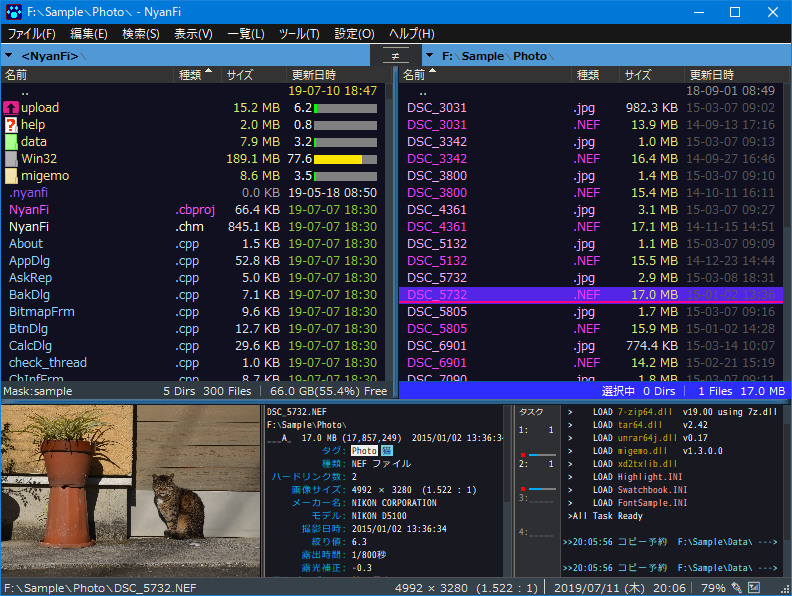

# NyanFi_x64

NyanFi is a dual pane file manager for Windows.  
Supported language is Japanese only.  

## Download Executable File
http://nekomimi.la.coocan.jp/freesoft/nyanfi.htm  

## Development Environment
C++Builder 10.4.1 (BCC64)
