# NyanFi - スクリーンショット

## メイン画面

横長画面ならこんなレイアウトにも  
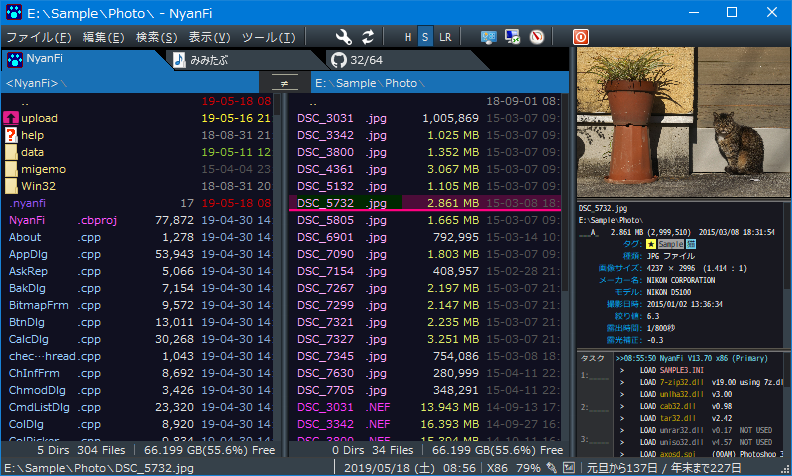  

## オプション設定

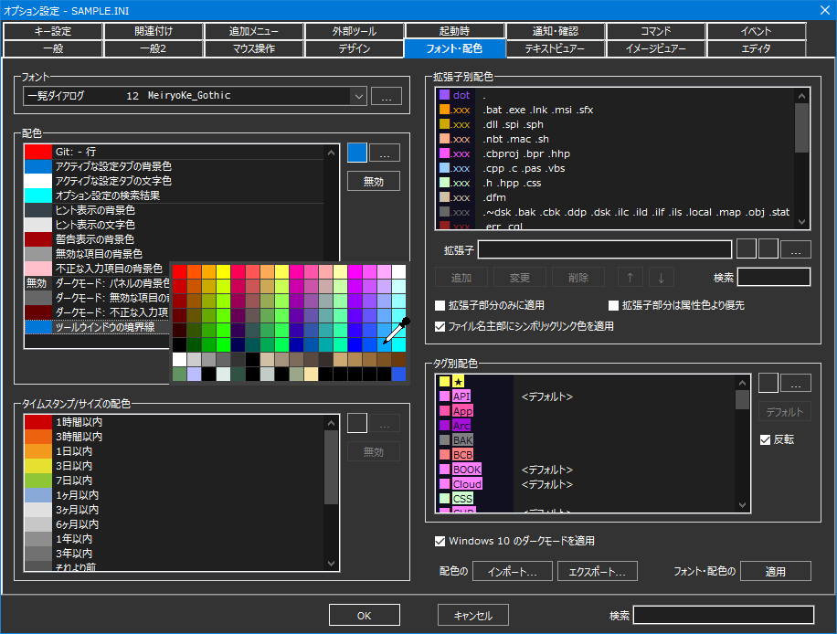  

## テキストビュアー

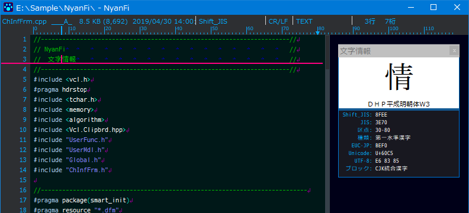  

バイナリ・ダンプ表示  
  

CSV/TSVの固定長表示  
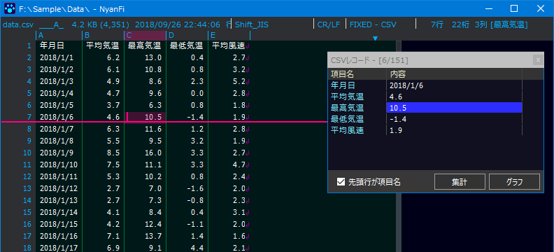  

## イメージビュアー

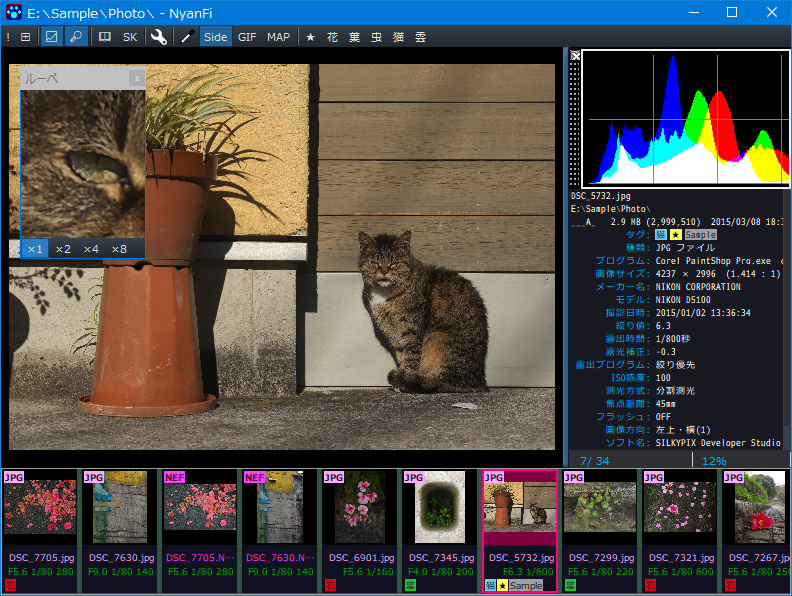  

見開き表示に対応  
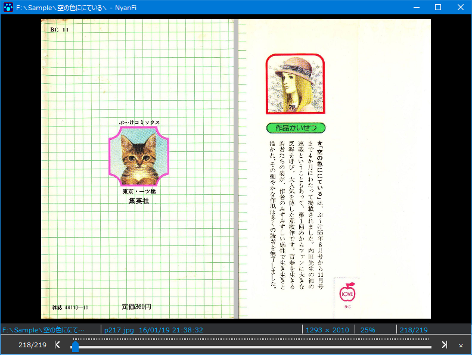  

実行ファイルなどのアイコンを抽出して一覧表示  
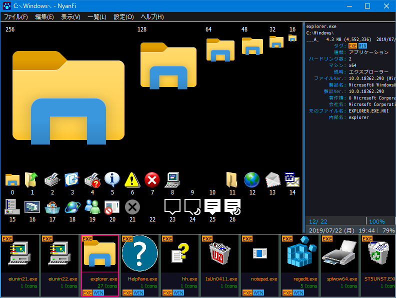  

## その他の機能

よく使うファイルをまとめて参照するワークリスト  
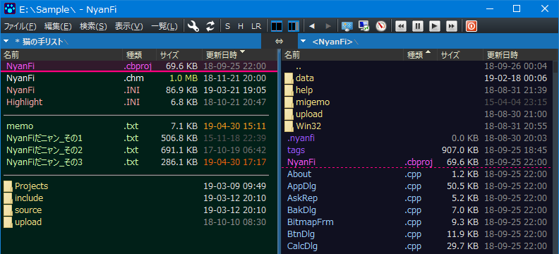  

GREP を実装、置換も可能  
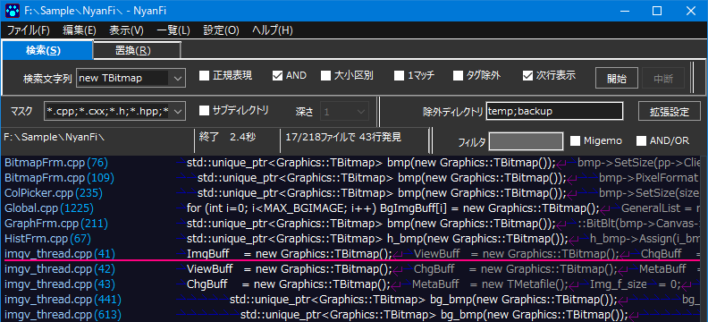  

ファイルの種類毎に多様な検索が可能  
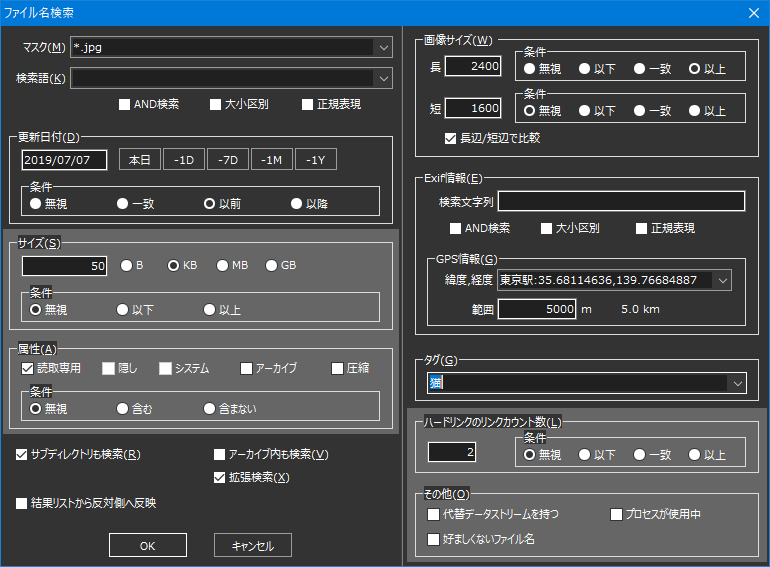  

タグによる検索  
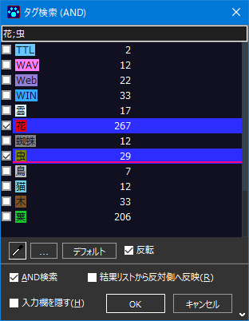  

改名方法もいろいろ  
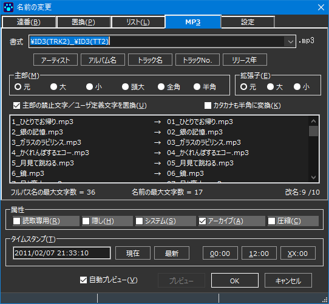  

ファイルの振り分け  
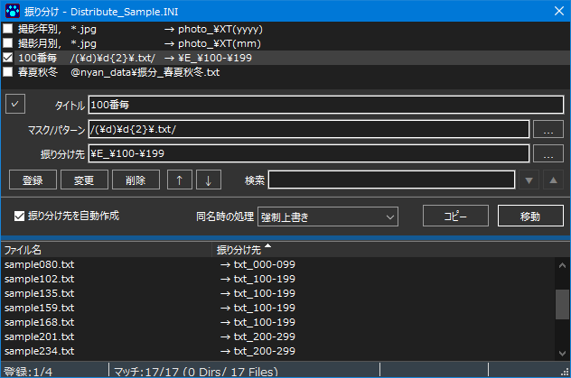  

拡張子別一覧  
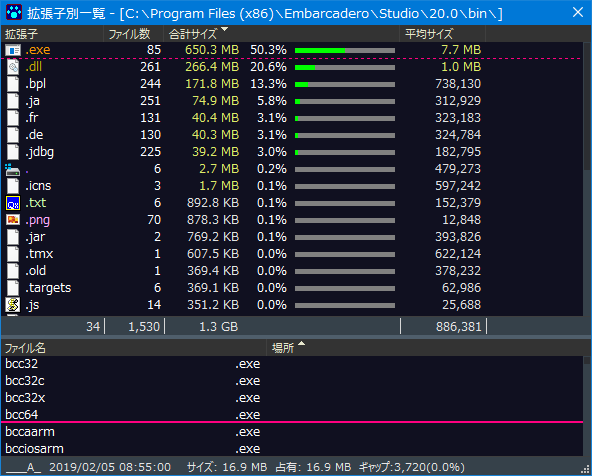  

ドライブ使用率推移  
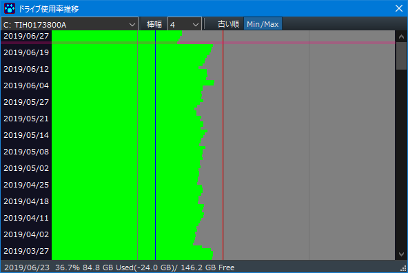  

タスクの切り替え、ランチャー  
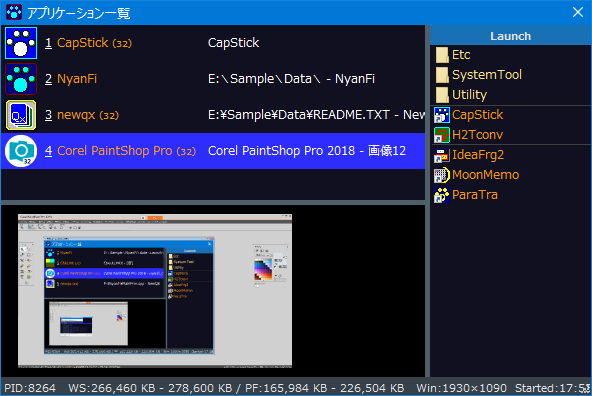  

Gitビュアー  
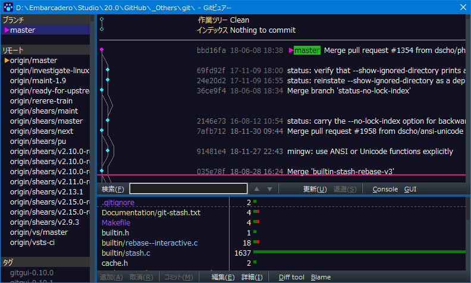  

XMLビュアー  
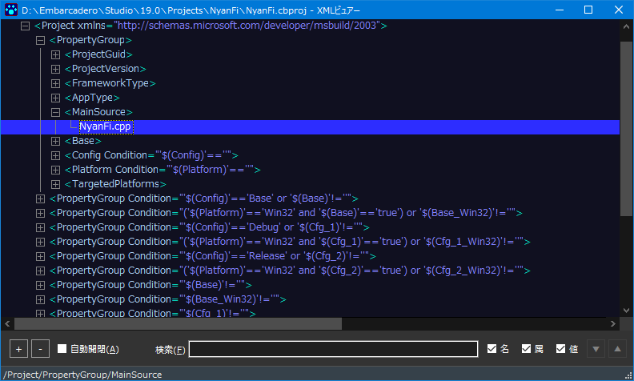  

JSONビュアー  
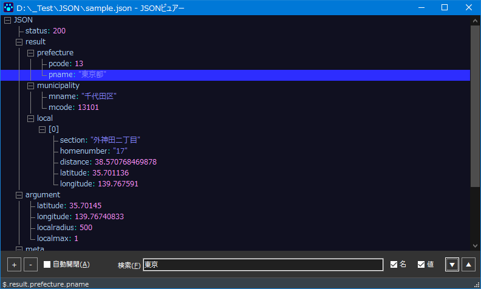  

正規表現チェッカー  
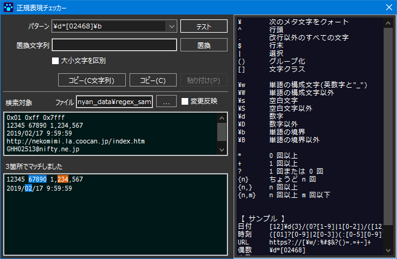  

数式を入力できる電卓  
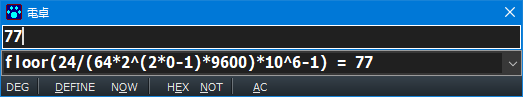  
